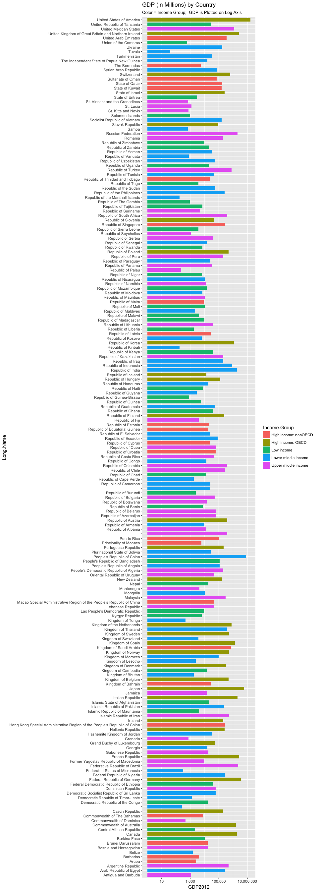

Introduction
------------

Data are freely available from the worldbank on both Education levels
and initiatives from various countries and also general data on gross
domestic product for each country. When combined and analyzed, one can
derive useful insight into how gdp and education might be related. This
is an observational study, so no causal inferences can be drawn, but the
relationships between the data sets are interesting and lead to more
questions that could theoretically be used to help inform future
decisions about education initiatives of the world bank. In particular,
this study looks at the question of whether or not OECD countries have a
higher GDP than non-OECD countries.

Getting Data
------------

This bit of code pulls down two csv files from the worldbank data sets
and downloads it to a subfolder of the project called "data". Note: If
the directory doesn't yet exist, this will create it.

    source("cs1_getdata.R") 

Tidying and Merging Data
------------------------

The GDP data set has some header rows, some extraneous rows at the end,
some columns we're not interested in, some blank lines and some blank
data.

Before merging with the Education data set, this set needs cleaned up.
In short, we remove the extraneous or blank columns, remove blank rows
and rows with missing data, and trim off the header and footer.

Once complete. there are 190 rows with full data in the GDP data set.
Now the data are ready to be merged with the Education data set (which
is significantly cleaner.) The code for loading the data into memory,
cleaning the gdp data set and merging with the Education data set is
found in cs1\_mergedata.R.

    source("cs1_mergedata.R")

    ## [1] "There are 41 empty records removed for this study, and 190 left for the analysis"

After removing the missing or irrelevant rows in the GDP data, there
were 190 rows left that show country (both name & code), GDP and
ranking. For the education data, there are 234 rows. The difference
between the two data sets can be found using the setdiff() set
operation:

    missing <- setdiff(edu$CountryCode, gdp$CountryCode)
    for (code in missing) {
      print(edu$Long.Name[edu$CountryCode==code])
    }

    ## [1] Principality of Andorra
    ## 234 Levels: American Samoa Antigua and Barbuda ... World
    ## [1] American Samoa
    ## 234 Levels: American Samoa Antigua and Barbuda ... World
    ## [1] Channel Islands
    ## 234 Levels: American Samoa Antigua and Barbuda ... World
    ## [1] Cayman Islands
    ## 234 Levels: American Samoa Antigua and Barbuda ... World
    ## [1] Republic of Djibouti
    ## 234 Levels: American Samoa Antigua and Barbuda ... World
    ## [1] East Asia & Pacific (developing only)
    ## 234 Levels: American Samoa Antigua and Barbuda ... World
    ## [1] East Asia & Pacific (all income levels)
    ## 234 Levels: American Samoa Antigua and Barbuda ... World
    ## [1] Europe & Central Asia (developing only)
    ## 234 Levels: American Samoa Antigua and Barbuda ... World
    ## [1] Europe & Central Asia (all income levels)
    ## 234 Levels: American Samoa Antigua and Barbuda ... World
    ## [1] Euro area
    ## 234 Levels: American Samoa Antigua and Barbuda ... World
    ## [1] Faeroe Islands
    ## 234 Levels: American Samoa Antigua and Barbuda ... World
    ## [1] Greenland
    ## 234 Levels: American Samoa Antigua and Barbuda ... World
    ## [1] Guam
    ## 234 Levels: American Samoa Antigua and Barbuda ... World
    ## [1] High income
    ## 234 Levels: American Samoa Antigua and Barbuda ... World
    ## [1] Heavily indebted poor countries (HIPC)
    ## 234 Levels: American Samoa Antigua and Barbuda ... World
    ## [1] Isle of Man
    ## 234 Levels: American Samoa Antigua and Barbuda ... World
    ## [1] Latin America & Caribbean (developing only)
    ## 234 Levels: American Samoa Antigua and Barbuda ... World
    ## [1] Socialist People's Libyan Arab Jamahiriya
    ## 234 Levels: American Samoa Antigua and Barbuda ... World
    ## [1] Latin America & Caribbean (all income levels)
    ## 234 Levels: American Samoa Antigua and Barbuda ... World
    ## [1] Least developed countries: UN classification
    ## 234 Levels: American Samoa Antigua and Barbuda ... World
    ## [1] Low income
    ## 234 Levels: American Samoa Antigua and Barbuda ... World
    ## [1] Principality of Liechtenstein
    ## 234 Levels: American Samoa Antigua and Barbuda ... World
    ## [1] Lower middle income
    ## 234 Levels: American Samoa Antigua and Barbuda ... World
    ## [1] Low & middle income
    ## 234 Levels: American Samoa Antigua and Barbuda ... World
    ## [1] Middle East & North Africa (all income levels)
    ## 234 Levels: American Samoa Antigua and Barbuda ... World
    ## [1] Middle income
    ## 234 Levels: American Samoa Antigua and Barbuda ... World
    ## [1] Union of Myanmar
    ## 234 Levels: American Samoa Antigua and Barbuda ... World
    ## [1] Middle East & North Africa (developing only)
    ## 234 Levels: American Samoa Antigua and Barbuda ... World
    ## [1] Commonwealth of the Northern Mariana Islands
    ## 234 Levels: American Samoa Antigua and Barbuda ... World
    ## [1] North America
    ## 234 Levels: American Samoa Antigua and Barbuda ... World
    ## [1] New Caledonia
    ## 234 Levels: American Samoa Antigua and Barbuda ... World
    ## [1] High income: nonOECD
    ## 234 Levels: American Samoa Antigua and Barbuda ... World
    ## [1] High income: OECD
    ## 234 Levels: American Samoa Antigua and Barbuda ... World
    ## [1] Democratic People's Republic of Korea
    ## 234 Levels: American Samoa Antigua and Barbuda ... World
    ## [1] French Polynesia
    ## 234 Levels: American Samoa Antigua and Barbuda ... World
    ## [1] South Asia
    ## 234 Levels: American Samoa Antigua and Barbuda ... World
    ## [1] Republic of San Marino
    ## 234 Levels: American Samoa Antigua and Barbuda ... World
    ## [1] Somali Democratic Republic
    ## 234 Levels: American Samoa Antigua and Barbuda ... World
    ## [1] Sub-Saharan Africa (developing only)
    ## 234 Levels: American Samoa Antigua and Barbuda ... World
    ## [1] Sub-Saharan Africa (all income levels)
    ## 234 Levels: American Samoa Antigua and Barbuda ... World
    ## [1] Turks and Caicos Islands
    ## 234 Levels: American Samoa Antigua and Barbuda ... World
    ## [1] Upper middle income
    ## 234 Levels: American Samoa Antigua and Barbuda ... World
    ## [1] Virgin Islands of the United States
    ## 234 Levels: American Samoa Antigua and Barbuda ... World
    ## [1] West Bank and Gaza
    ## 234 Levels: American Samoa Antigua and Barbuda ... World
    ## [1] World
    ## 234 Levels: American Samoa Antigua and Barbuda ... World

The reason these are missing from the merged data is because there was
no data collected from them in the world bank gdp data.

The following code merges the data into a single data set. Note that
rows with NA's or empty fields within the education data set were not
yet removed, since not all analysis requires a complete data set in all
columns.

Now that the getting, cleaning and merging of the data are all complete,
we can move on to answering interesting questions about the data set.

### Question 1:

Merging on the field "CountryCode", there are 189 rows that match (there
were 190 'complete' rows in the GDP data.) The reason for the mis match
between 234 total rows and 189 matching rows is explained above using
the setdiff operation.

The one economy that is missing from the education data set, but appears
in the gdp data set is "South Sudan". The GDP data has both South Sudan
and Sudan, whilst the education data only has "Republic of Sudan." The
time from 2010 to present has been a volatile time for Sudan, with
confusing national borders, economies, widespread violence, elections,
etc. For the purposes of this study, we will consider Sudan (SDN) GDP,
since there is a match in both data sets, and not South Sudan GDP, which
we will consider an 'incomplete' case.

### Question 2:

After sort in ascending order by GDP, using the following code:

    ## [1] St. Kitts and Nevis
    ## 234 Levels: American Samoa Antigua and Barbuda ... World

The Country with the 13th lowest GDP is St. Kitts and Nevis.

### Question 3:

The organization for economic cooperation and development (OECD) was
established to promote policies that would improve the economic and
social well-being of people around the world
(<http://www.oecd.org/about/>). An interesting question to analyze is
that of whether or not OECD countries with high Income have
higher-ranked GDPs on average than Non-OECD, yet still high-income
countries.

To calculate the average GDP rankings for the High Income: OECD and High
Income: nonOECD groups, we use the following code:

    ## [1] 109.0667

    ## [1] 92.73913

The average rank of high income OECD countries is 32.97, while the
average rank of non-oecd high income countries is 91.91, almost 60 ranks
lower on average. While this is just an observational study, and we
therefore cannot attributed the rank difference to OECD membership, it
is nonetheless interesting and worth further exploration.

### Question 4:

Below is a plot of the GDP for all countries. Note that the GDP is
plotted on a log scale so that you can see the countries with the
smaller GDPs. Also, the bars are colored by their Income.Group.

Note also that there are some missing lables in the plot. Those are
(from top to bottom, respectively):

1.  Rep\\xfablica Bolivariana de Venezuela
2.  Democratic Republic of S\\xe3o Tom\\xe9 and Principe
3.  Republic of C\\xf4te d'Ivoire

There is clearly an issue with encoding characters in the data file. If
I have time I will go back and manually fix this.

    library(ggplot2)
    data <- all

    ggplot(all, aes(x=Long.Name, y=GDP2012)) + 
      geom_bar(stat='identity', aes(fill=Income.Group), width=0.75) +
      labs(title = "GDP (in Millions) by Country", subtitle="Color = Income Group;  GDP is Plotted on Log Axis") +
      coord_flip() + 
    #  theme(text= element_text(size=06)) + 
      scale_y_log10(label=scales::comma)

### Question 5:

To illustrate how GDP Ranking compares with Income group, we cut the GDP
rankings into 5 quantile groups and compare against income groups in a
table.

To get the quantile cutoffs from the rank, we run the quantile()
function.

    rank_quantile <- quantile(as.numeric(all$Rank), probs = c(0,20,40, 60, 80, 100)/100.0)
    ranks_quantile_vector <- c(rank_quantile[[1]], rank_quantile[[2]], rank_quantile[[3]], rank_quantile[[4]], rank_quantile[[5]], rank_quantile[[6]])

We set the ranking percentage cutoffs at 0%, 20%, 40%, 60%, 80%, and
100%, with the following results for gdp rank quantiles.

-   0% - 2
-   20% - 40.6
-   40% - 78.2
-   60% - 114.8
-   80% - 152.4
-   100% - 190.0

As expected, the ranks are about evenly split amongst the 5 groups since
since the ranks are in order from 1 to 190 with equal steps between each
rank, and no breaks.

When put into a table to compare Income.Group with Rank Quantile, we see
that 4 of the low income group are ranked in the top 20% of all
countries' GDP, while 4 of the High Income OECD countries are ranked in
the lower 20% of all countries' GDP.

    ##                       
    ##                        [2,40.6] (40.6,78.2] (78.2,115] (115,152] (152,190]
    ##                               0           0          0         0         0
    ##   High income: nonOECD        5           6          1         6         5
    ##   High income: OECD           5           1          8        13         3
    ##   Low income                 11          17          4         1         4
    ##   Lower middle income        10           9         11        11        13
    ##   Upper middle income         7           5         13         7        13

Of Lower Middle Income countries, there are 13 within the top 38 nations
with the highest GDP.

Conclusion
----------

In general, one would think that OECD membership would place countries
higher on the GDP-ranking scale, but based on our preliminary analysis,
that may not be the case. Of the top 38 ranked countries, 68% are from
Upper and Lower Middle income groups, and only 7% are from High Income
OECD groups.
